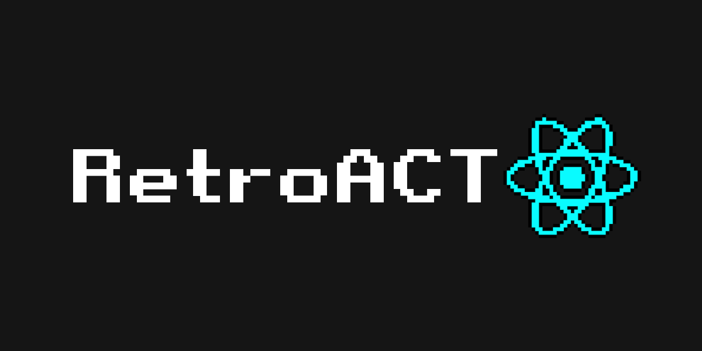

# RetroAct

### Frontend interface to Retrogaming, inspired in Steam Big Picture Mode and Kart Project

The idea behind is to create a react interface + electron to launch games with RetroArch and have media options like Netflix and Youtube. When installed soon as the operation system boots, the interface enter in full-screen mode.

# Table of Contents
1. [Installation](#install)
2. [Credits](#credits)
3. [References](#references)

<a name="install"></a>
## Instalation
This should be really simple to install, and intended to run in linux systems primarily

You need to install [g++](https://unix.stackexchange.com/questions/140350/linux-g-command-not-found):
```bash
apt-get install build-essential
```

Then you need to install the node dependencies:
```bash
npm install
```

And run with:
```bash
npm start
```

<a name="credits"></a>
## Credits
This react logo pixelated was only possible using [Pixelator](http://pixelatorapp.com/)

<a name="references"></a>
## References
[Kart Project](https://github.com/maddox/kart)

[Steam Big Picture](https://store.steampowered.com/bigpicture)
