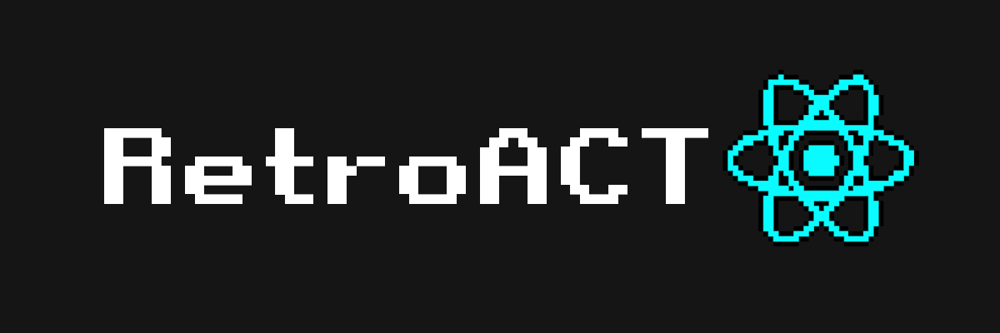

# RetroAct

### Frontend interface to Retrogaming, inspired in Steam Big Picture Mode and Kart Project

The idea behind is to create a react interface + nw.js to launch games with RetroArch and have media options like Netflix and Youtube. When installed soon as the operation system boots, the interface enter in full-screen mode.

The reason that I don't use Electron it's because I can't run Node commands, at least I don't know how and besides that Nw.js shows really simple to development.

# Table of Contents
1. [Installation](#install)
2. [Credits](#credits)
3. [References](#references)

<a name="install"></a>
## Instalation
This should be really simple to install, and intended to run in linux systems primarily

You gonna need to install the node dependencies:
```bash
npm install
```
Then you will need to install Nw.js in your system, the simplest way is to install with nw.js manager
```bash
npm i -g nwjs
//And install with
nw install 0.44.1-sdk
```

And run with:
```bash
npm run-script nwjs-dev
```

<a name="credits"></a>
## Credits
This react logo pixelated was only possible using [Pixelator](http://pixelatorapp.com/)

<a name="references"></a>
## References
[Kart Project](https://github.com/maddox/kart)

[Steam Big Picture](https://store.steampowered.com/bigpicture)
